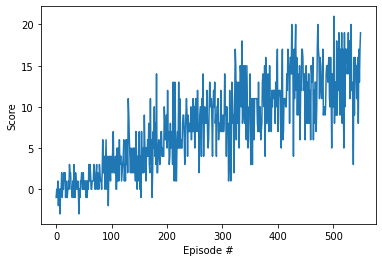

# Project Report: Navigation

## 1. Learning Algorithm

The agent uses a **Deep Q-Network (DQN)** algorithm to solve the environment.
DQN approximates the Q-value function using a neural network, allowing the agent to learn policies in high-dimensional state spaces.

### Key Components:
* **Experience Replay:** The agent stores experiences `(state, action, reward, next_state, done)` in a replay buffer. During training, random batches of experiences are sampled to break the correlation between consecutive steps, leading to more stable training.
* **Fixed Q-Targets:** Two networks are used: a local network (updated frequently) and a target network (updated slowly). This prevents the moving target problem and stabilizes learning.

### Hyperparameters:
The following hyperparameters were used for training:

* **Replay Buffer Size:** 100,000 (`1e5`)
* **Batch Size:** 64
* **Gamma (Discount Factor):** 0.99
* **Tau (Soft Update):** 0.001 (`1e-3`)
* **Learning Rate:** 0.0005 (`5e-4`)
* **Update Every:** 4 steps

## 2. Model Architecture

The model is a simple feed-forward neural network (Fully Connected Layers) implemented in PyTorch.

* **Input Layer:** 37 units (corresponding to the state size)
* **Hidden Layer 1:** 64 units (Activation: ReLU)
* **Hidden Layer 2:** 64 units (Activation: ReLU)
* **Output Layer:** 4 units (corresponding to the action size: Forward, Backward, Left, Right)

## 3. Plot of Rewards

The agent solved the environment (Average Score > 13.0) in approximately 450 episodes.

*(Note: Please refer to the notebook for the generated plot image.)*

## 4. Ideas for Future Work

To further improve the agent's performance, the following techniques could be implemented:

1.  **Double DQN:** To address the overestimation bias of Q-values.
2.  **Prioritized Experience Replay:** To sample important experiences (those with high TD error) more frequently, speeding up learning.
3.  **Dueling DQN:** To separately estimate the state-value function and the advantage function, which can be beneficial in states where the action choice doesn't matter much.